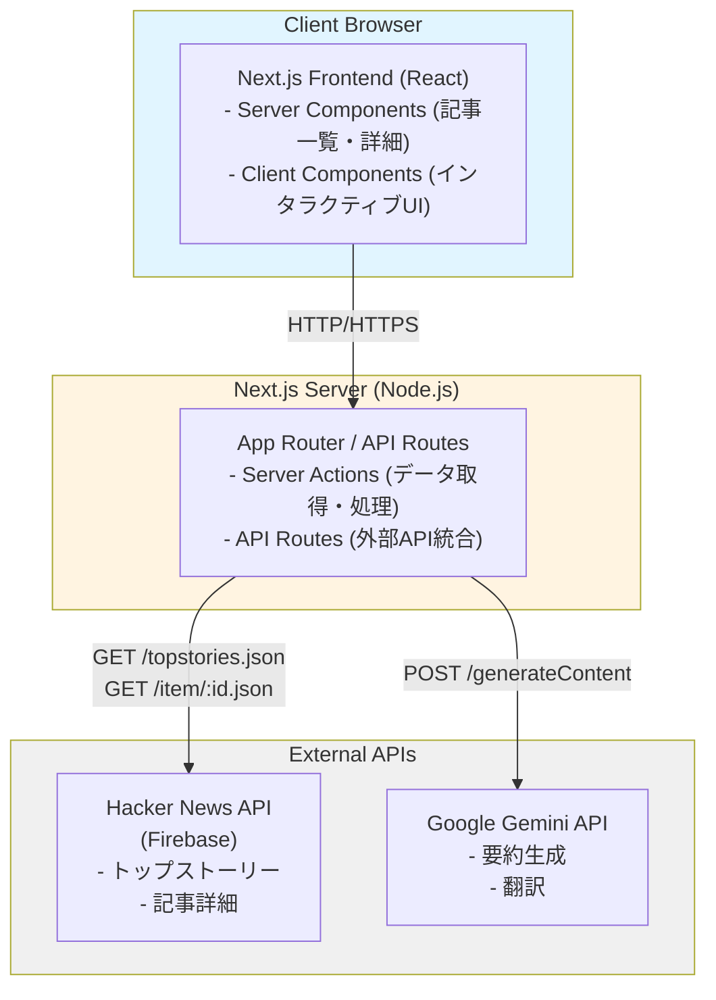
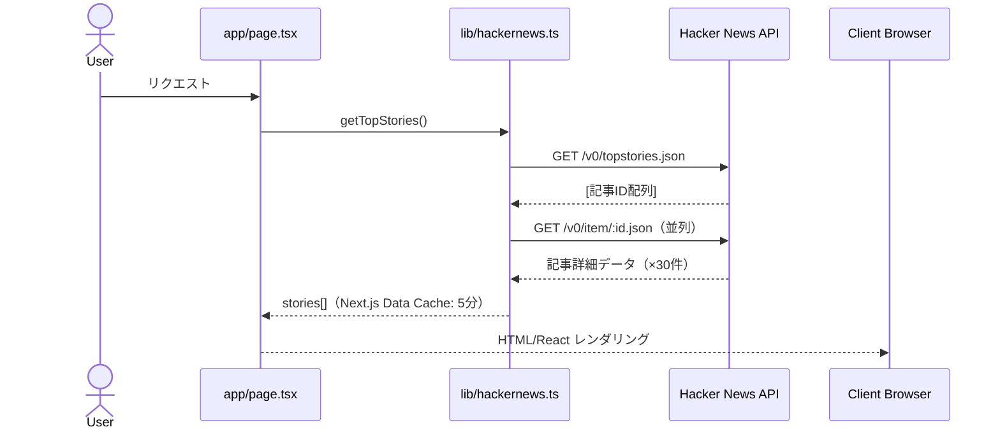
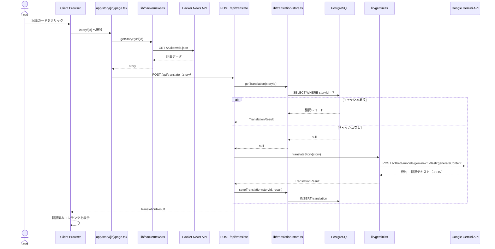

# Hacker News 翻訳サイト - システムアーキテクチャ設計書

## 1. システム概要

### 1.1 目的

Hacker NewsのトップストーリーをGoogle Gemini APIで要約・日本語翻訳し、読みやすい形式で提供するWebアプリケーション。

### 1.2 主要機能

- Hacker Newsトップストーリーの取得・表示
- 記事の要約生成
- 日本語への自動翻訳
- レスポンシブなUI/UX

---

## 2. システムアーキテクチャ

### 2.1 全体構成図



### 2.2 技術スタック

| レイヤー          | 技術         | バージョン        | 用途                         |
| ----------------- | ------------ | ----------------- | ---------------------------- |
| フロントエンド    | Next.js      | 16.x (App Router) | SSR/SSG、ルーティング        |
| 言語              | TypeScript   | 5.x               | 型安全性                     |
| UIライブラリ      | React        | 18+               | コンポーネントベース開発     |
| スタイリング      | Tailwind CSS | 3.x               | ユーティリティファースト CSS |
| HTTP クライアント | Fetch API    | Native            | API通信                      |
| ORM               | Prisma       | latest            | DB操作（PostgreSQL）         |
| データベース      | PostgreSQL   | 17                | 翻訳キャッシュ永続化         |
| ランタイム        | Node.js      | 24+               | サーバーサイド実行           |

---

## 3. コンポーネント設計

### 3.1 ディレクトリ構造

```
src/
├── app/                      # Next.js App Router
│   ├── layout.tsx            # ルートレイアウト
│   ├── page.tsx              # ホームページ（記事一覧）
│   ├── globals.d.ts          # グローバル型宣言
│   ├── story/
│   │   └── [id]/
│   │       └── page.tsx      # 記事詳細ページ
│   └── api/
│       └── translate/
│           └── route.ts      # 翻訳エンドポイント（POST）
├── components/               # Reactコンポーネント
│   ├── StoryList.tsx         # 記事一覧コンポーネント
│   ├── StoryCard.tsx         # 記事カード
│   ├── StoryDetail.tsx       # 記事詳細
│   ├── TranslatedContent.tsx # 翻訳済みコンテンツ
│   └── Loading.tsx           # ローディングUI
├── lib/                      # ユーティリティ・ロジック
│   ├── hackernews.ts         # Hacker News API クライアント
│   ├── gemini.ts             # Google Gemini API クライアント（gemini-2.5-flash）
│   ├── db.ts                 # Prisma クライアント（PostgreSQL）
│   ├── translation-store.ts  # 翻訳キャッシュ管理（DB経由）
│   └── types.ts              # 型定義
├── middleware.ts              # Basic認証ミドルウェア（全ルート対象）
├── generated/prisma/         # Prisma 生成コード（自動生成）
└── styles/
    └── globals.css           # グローバルスタイル
```

### 3.2 主要コンポーネント

#### 3.2.1 Server Components（サーバーサイドレンダリング）

- `app/page.tsx`: トップストーリー一覧ページ
- `app/story/[id]/page.tsx`: 記事詳細ページ

#### 3.2.2 Client Components（クライアントサイドインタラクション）

- `StoryCard.tsx`: 記事カード（ホバー効果、クリックイベント）
- `TranslatedContent.tsx`: 翻訳コンテンツ（展開/折りたたみ）

#### 3.2.3 Prisma スキーマ（`prisma/schema.prisma`）

```prisma
model Translation {
  storyId   Int      @id
  titleJa   String
  summaryJa String
  createdAt DateTime @default(now())
  updatedAt DateTime @updatedAt
}
```

---

## 4. データフロー

### 4.1 記事一覧取得フロー



### 4.2 記事翻訳フロー



---

## 5. 外部API統合

### 5.1 Hacker News API

#### エンドポイント

- **Base URL**: `https://hacker-news.firebaseio.com/v0`
- **トップストーリー**: `GET /topstories.json`
  - レスポンス: `[ID配列]` (最大500件)
- **記事詳細**: `GET /item/{id}.json`
  - レスポンス: `{ id, type, by, time, title, url, score, descendants, ... }`

#### 制約・考慮事項

- 認証不要
- レート制限なし（実質）
- 記事本文は含まれない（`url` フィールドからリンク先へ）
- コメント情報は `kids` フィールドに含まれる

#### 実装方針

**Phase 1（簡易版）**: タイトルとURLのみ翻訳
**Phase 2（拡張版）**: リンク先URLをスクレイピングして本文も翻訳

### 5.2 Google Gemini API

#### エンドポイント

- **Base URL**: `https://generativelanguage.googleapis.com`
- **テキスト生成**: `POST /v1beta/models/gemini-2.5-flash:generateContent`

#### 認証

- APIキー方式: リクエストヘッダー `x-goog-api-key`
- 環境変数 `GEMINI_API_KEY` で管理

#### リクエストボディ例

```json
{
  "contents": [
    {
      "parts": [
        {
          "text": "あなたはHacker News記事の翻訳アシスタントです。...\nTitle: ...\nURL: ..."
        }
      ]
    }
  ],
  "generationConfig": {
    "temperature": 0.2
  }
}
```

#### レスポンス形式（JSON）

```json
{
  "titleJa": "日本語タイトル",
  "summaryJa": "日本語要約...",
  "warning": ""
}
```

#### レート制限

- 無料枠: 60 requests/min
- 有料プラン: より高いレート制限

#### エラーハンドリング

- 429 Too Many Requests → リトライ（exponential backoff）
- 400 Bad Request → プロンプト調整
- 500 Internal Server Error → リトライ（最大3回）

---

## 6. キャッシュ戦略

### 6.1 Next.js Data Cache（HN API）

Next.jsのApp Routerでは、`fetch()`のレスポンスが自動的にキャッシュされます。

#### 記事一覧（トップストーリー）

```typescript
// 5分間キャッシュ
const response = await fetch(
  'https://hacker-news.firebaseio.com/v0/topstories.json',
  {
    next: { revalidate: 300 }, // 5分
  }
);
```

#### 記事詳細

```typescript
// 1時間キャッシュ
const response = await fetch(
  `https://hacker-news.firebaseio.com/v0/item/${id}.json`,
  {
    next: { revalidate: 3600 }, // 1時間
  }
);
```

### 6.2 翻訳キャッシュ（PostgreSQL + Prisma）

翻訳結果はNext.js Data Cacheでなく、**PostgreSQLに永続保存**します。

```typescript
// translation-store.ts
export async function getTranslation(
  storyId: number
): Promise<TranslationResult | null>;
export async function saveTranslation(
  storyId: number,
  result: TranslationResult
): Promise<void>;
```

- 同じ記事IDのリクエストはDBから即座にレスポンス（Gemini API呼び出し不要）
- DBに存在しない場合のみ Gemini API を呼び出して保存

### 6.3 将来的な拡張（オプション）

- 翻訳レコードの TTL 管理（古い翻訳の自動削除）
- ユーザーごとのお気に入り管理

---

## 7. エラーハンドリング戦略

### 7.1 エラータイプと対応

| エラータイプ    | 原因                 | 対応                                      |
| --------------- | -------------------- | ----------------------------------------- |
| Network Error   | API接続失敗          | リトライ（3回まで）→ エラーメッセージ表示 |
| API Rate Limit  | Gemini APIレート制限 | Exponential backoff → キューイング        |
| Invalid API Key | 環境変数未設定       | サーバー起動時にバリデーション            |
| 404 Not Found   | 存在しない記事ID     | エラーページ表示                          |
| Timeout         | レスポンス遅延       | 30秒でタイムアウト → リトライ             |

### 7.2 実装パターン

```typescript
// lib/gemini.ts - translateStory()
// GEMINI_API_KEY未設定時はエラーを返さず原文表示
if (!process.env.GEMINI_API_KEY) {
  return {
    titleJa: story.title,
    summaryJa: '翻訳機能は現在利用できません。',
    error: '...',
  };
}

// URL先アクセス不能時はタイトルベース要約にフォールバック
// warning フィールドでUIに通知

// api/translate/route.ts - バリデーション
// title: 非空・256文字以内, url: 非空・2048文字以内
// 翻訳成功かつ story.id がある場合のみ DB保存
```

---

## 8. セキュリティ設計

### 8.1 APIキー管理

#### 環境変数による管理

```bash
# .env.local (gitignoreに追加)
GEMINI_API_KEY=your_api_key_here
BASIC_AUTH_USER=your_user
BASIC_AUTH_PASSWORD=your_password
DATABASE_URL=postgresql://...
```

#### サーバーサイドでのみ使用

- APIキーはクライアントに露出しない
- Server ComponentsまたはAPI Routesでのみアクセス
- `process.env.GEMINI_API_KEY`

#### 起動時バリデーション

```typescript
// lib/gemini.ts
if (!process.env.GEMINI_API_KEY) {
  throw new Error('GEMINI_API_KEY is not set');
}
```

### 8.2 Basic認証

- `src/middleware.ts` でサイト全体（`/api` 含む）に Basic認証を適用
- Edge Runtimeで動作するため、Node.js の `crypto` モジュールは不使用（`atob` で Base64 デコード）
- 未設定時は 500 エラーを返す（誤って認証なし公開を防止）

```typescript
export const config = {
  matcher: ['/((?!_next/static|_next/image|favicon.ico).*)'],
};
```

### 8.3 XSS対策

- Reactのデフォルトエスケープ機能を活用
- `dangerouslySetInnerHTML`は使用しない
- ユーザー入力は存在しないため、追加対策不要

### 8.3 CORS設定

- Next.js API Routesはデフォルトで同一オリジン
- 外部からのAPIアクセスは不要（今回のケース）

---

## 9. パフォーマンス最適化

### 9.1 Server Components活用

- 記事一覧・詳細ページはServer Componentsで実装
- データ取得はサーバーサイドで完結（クライアントJavaScript削減）

### 9.2 並列データ取得

```typescript
// 複数記事を並列取得
const storyPromises = topStoryIds.slice(0, 30).map((id) => getStoryById(id));
const stories = await Promise.all(storyPromises);
```

### 9.3 画像最適化

- Next.jsの`<Image>`コンポーネント使用
- 自動的なWebP変換・遅延読み込み

### 9.4 コード分割

- Dynamic Imports for client components

```typescript
const InteractiveComponent = dynamic(() => import('./InteractiveComponent'), {
  loading: () => <Skeleton />
});
```

### 9.5 Streaming SSR

- React Suspenseを活用した段階的レンダリング

```tsx
<Suspense fallback={<LoadingSpinner />}>
  <StoryList />
</Suspense>
```

---

## 10. 非機能要件

### 10.1 パフォーマンス

- 記事一覧の初回表示: 2秒以内
- 記事詳細の翻訳表示: 5秒以内
- Lighthouse Score: 90以上（Performance）

### 10.2 可用性

- 外部API障害時もエラーメッセージで適切に対応
- タイムアウト設定でハングを防止

### 10.3 スケーラビリティ

- Vercelのエッジネットワークによる世界展開
- Gemini APIのレート制限内での運用

### 10.4 保守性

- TypeScriptによる型安全性
- コンポーネント単位での責務分離
- ESLint + Prettierでコード品質維持

---

## 11. デプロイ戦略

### 11.1 推奨プラットフォーム: Vercel

#### メリット

- Next.jsとの完全統合
- 自動ビルド・デプロイ
- エッジネットワーク（CDN）
- 環境変数管理

#### デプロイフロー

```
GitHub push (main branch)
    ↓
Vercel Auto Build
    ↓
Production Deploy
    ↓
https://your-app.vercel.app
```

### 11.2 環境変数設定

Vercel Dashboardで以下を設定:

- `GEMINI_API_KEY`: Google Gemini APIキー
- `DATABASE_URL`: PostgreSQL接続文字列
- `BASIC_AUTH_USER`: Basic認証ユーザー名
- `BASIC_AUTH_PASSWORD`: Basic認証パスワード
- `NODE_ENV`: `production`

### 11.3 代替プラットフォーム

- Netlify
- AWS Amplify
- Google Cloud Run

---

## 12. 今後の拡張案

### Phase 3: 機能拡張

- [ ] コメントの翻訳
- [ ] カテゴリ別フィルタリング
- [ ] 検索機能
- [ ] お気に入り機能（要ユーザー認証）

### Phase 4: パフォーマンス改善

- [ ] Vercel KVによる翻訳キャッシュ
- [ ] WebSocketでのリアルタイム更新
- [ ] Progressive Web App (PWA) 対応

### Phase 5: 多言語対応

- [ ] 英語以外の言語への翻訳（中国語、スペイン語等）
- [ ] 言語選択UI

---

## 13. 参考資料

- [Hacker News API Documentation](https://github.com/HackerNews/API)
- [Google Gemini API Documentation](https://ai.google.dev/docs)
- [Next.js App Router Documentation](https://nextjs.org/docs/app)
- [Vercel Deployment Guide](https://vercel.com/docs)
